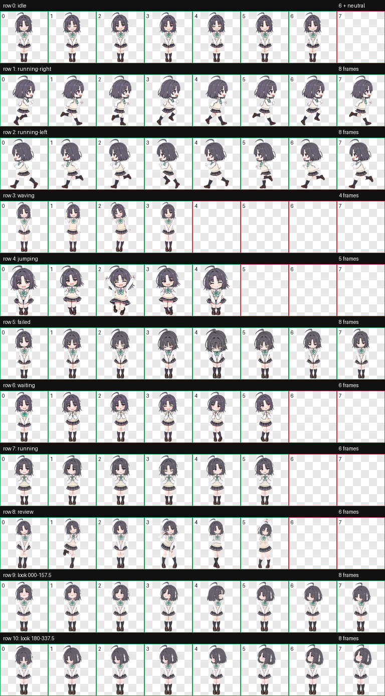
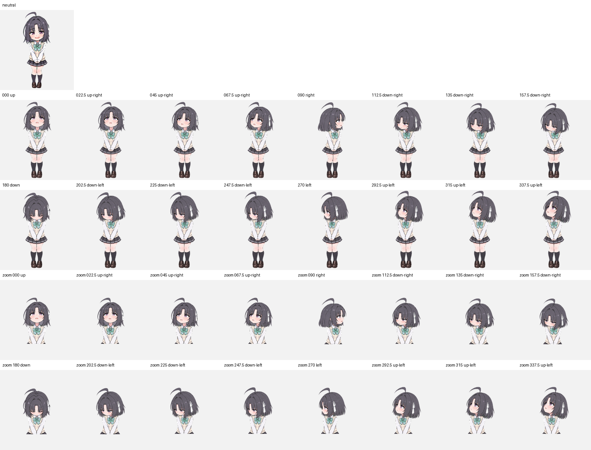
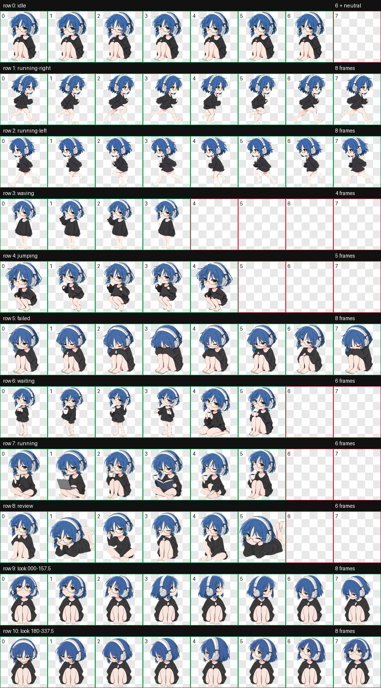
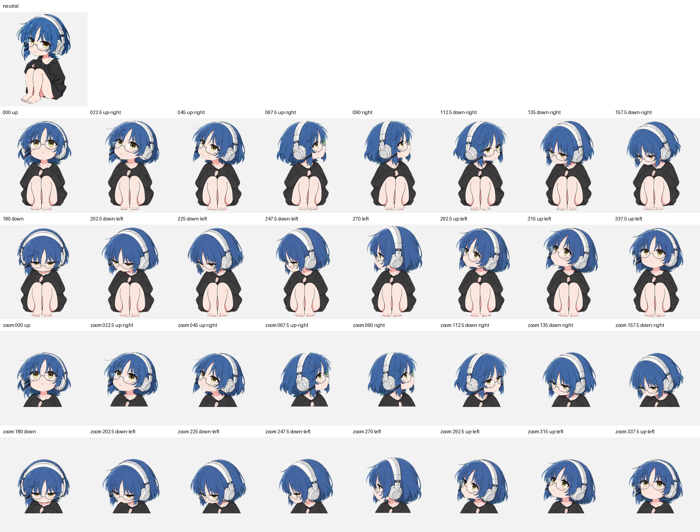

# My Codex Pets

Two Codex-compatible animated pets, drawn as Japanese anime-style chibi stickers and packaged with the v2 pet contract.

## 安和昴

A shy, warm-hearted companion with charcoal bobbed hair, violet eyes, and a mint striped bow.





## 山田凉

A calm blue-haired companion with glasses and white headphones. Her coffee cup appears only in waiting and active-work animations.





## Package details

- Codex pet schema v2 (`spriteVersionNumber: 2`)
- 8 × 11 WebP sprite atlas per pet
- Nine standard animation rows
- Sixteen clockwise look directions
- Transparent backgrounds and validated cell boundaries
- Original reference images are not included in this repository

## Install

Copy either pet folder into your Codex pets directory. On Windows PowerShell:

```powershell
Copy-Item -Recurse -Force .\pets\an-he-mao "$env:USERPROFILE\.codex\pets\an-he-mao"
Copy-Item -Recurse -Force .\pets\yamada-ryo "$env:USERPROFILE\.codex\pets\yamada-ryo"
```

Restart or reload Codex if the newly installed pets do not appear immediately.

## Repository layout

```text
pets/
  an-he-mao/
    pet.json
    spritesheet.webp
  yamada-ryo/
    pet.json
    spritesheet.webp
previews/
  an-he-mao-contact-sheet.png
  an-he-mao-look-directions.png
  yamada-ryo-contact-sheet.png
  yamada-ryo-look-directions.png
```

These are personal, fan-made pet assets. No affiliation or endorsement is implied.
